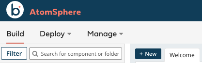
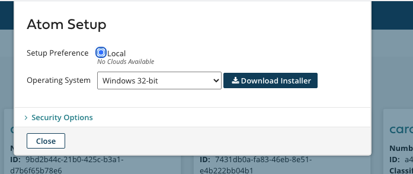

author: Tamimi
summary: Getting started with Boomi and Solace
id: boomi-getting-started
tags:
categories: Boomi
environments: Web
status: Draft
feedback link: 
analytics account: UA-3921398-10

# Boomi featuring Solace

## 🤓 What you'll learn 
Duration: 0:02:00

In this tutorial, you will learn how to configure and use the Solace Boomi connector. This is done in 4 easy steps
1. Configure your Solace PubSub+ Event Broker (Hardware, Software, SasS)
1. Setup your Boomi platform
1. Configure the Solace connector in the Boomi platform
1. Send/Receive messages between Boomi and Solace

Positive
: Note that this tutorial is meant to be platform and programming language agnostic. Meaning that regardless what operating system you are running (Mac, Linux, Windows), programming languages or messaging AIPs you choose to use, the setup will be the same.

### Prerequisite 
This tutorial assumes:
* MacOS/Linux users have knowledge using Docker
* Access to a Solace broker (explained in Step 2)
* Access to a Boomi environment (explained in Step 3)

## 📌 Setup a Solace PubSub+ Broker 
Duration: 0:05:00

Access to a Solace messaging service, Solace PubSub+, can be achieved in either one of the three flavours
1. Hardware Appliance
1. Software broker image (Docker, Virtual image)
1. Solace Cloud service instance

This tutorial will walk you through setting up a Solace Cloud service instance. If you are interested in setting up a local broker running on Docker or a virtual machine check out the [PubSub+ Event  Broker: Software](https://docs.solace.com/Solace-SW-Broker-Set-Up/SW-Broker-Image-Setup.htm) documentation

### Sign up for free Solace Cloud account 
Navigate to the [Create a New Account](https://console.solace.cloud/login/new-account) page and fill out the required information. No credit card required!

### Create a messaging service
After you create your Solace Cloud account and sign in to the Solace Cloud Console, you'll be routed to the event mesh page.

Click on 'Messaging Services' and all the messaging services associated with your account will show up if you have any already created. To create a new service, click either button as depicted in the image below:

Fill out all the details for your messaging service, and then click "Create" at the bottom of the page.

Your service should be ready to use in a couple seconds! 🌪

## 📌 Setup Boomi Platform
Duration: 0:20:00

### Core concepts
Boomi builds, deploys and manage all the processes in a concept called **Atoms**, which is a lightweight Java application that is deployed on a host with Internet access. This of it as your single-tenant, single-node runtime engine. There are two deployment models for Atoms:

1. In-the-cloud deployment (using Boomi Atom Cloud)
1. On-premise deployment (using local Atom setup)

Positive
: The Boomi Atom is a lightweight, dynamic runtime engine. Once your integration processes have been deployed to your Atom, the Atom contains all the components required to execute your processes from end to end, including connectors, transformation rules, decision handling, and processing logic.

### Create a Boomi trial account
if you dont have an account, navigate to [https://boomi.com/form/trial/](https://boomi.com/form/trial/) and sign up for a free account

After you sign up for a Boomi platform account and login, you will have access to the Boomi AtomSphere platform - your one stop shop for all your integrations

* Build: This is where you design and package your process (i.e. architecture)
* Deploy: This is where you deploy the packaged process in your Atom for execution
* Manage: This is where you configure your environment and Atoms

### Configure a local Atom
In this tutorial, we will be setting up a local Atom. Either follow the steps below or navigate to the links below for more information

1. [Windows Machine](https://help.boomi.com/bundle/integration/page/t-atm-Installing_a_local_Atom_on_Windows_beec31b0-477d-430b-a744-cedb3a8d67eb.html).
1. [Using Docker](https://help.boomi.com/bundle/integration/page/t-atm-Using_Docker_to_install_a_local_Atom_on_Linux_b54f0e8c-c02c-4eea-87f5-7233d1c5e0a5.html).

👉 Navigate to the **Manage** tab and click on **Atom Management**

👉 Click on **+New** and choose **Atom**

👉 Choose the operating system of choice in the **Atom Setup** box

### Notes on Docker installation
The installer is a shell script that you run locally and automatically configure your docker setup

1. `./atomdocker_install64.sh -h` for more information on how to run it
1. You can generate a token by clicking on **Generate Token** under **Security Options** 
1. Use the generated token as follows `./atomdocker_install64.sh -n <docker_container_name> -k <isnert_token>`
1. Create a `/var/boomi` directory because the script assumes it already exists and make sure its owned by the current user
    1. Navigate to `/var/boomi/` after you create it
    1. Execute the following from terminal `chown $USER .`
    1. Make sure this directory is shared on docker. This is done by opening the docker preferences and adding it under **File Shareing Resources** tab

Viola! Now you have your Solace and Boomi environment setup

## 🛠 Configure Solace Broker 
Duration: 0:07:00

## 🛠 Setup Solace connector in Boomi 
Duration: 0:07:00

## Connect Everything!
Duration: 0:07:00

## Bonus: Add more publishers
Duration: 0:07:00

